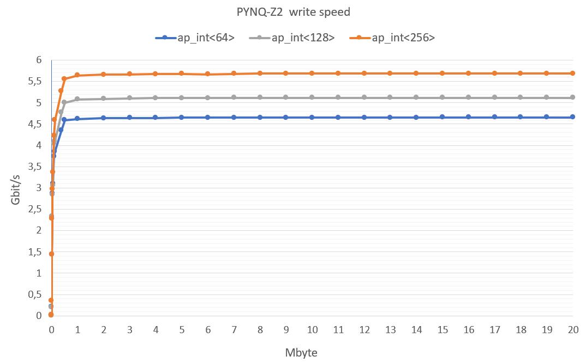

# Analyzing FPGA Off-Chip Memory Bandwidth

**Author:** Lorenzo Rocco Didò  

This project aims to calculate the FPGA off-chip memory bandwidth. In this specific case, I choose an SoC, the Pynq-Z2. I carried out tests on three cases that differ in the size of the burst (64-bit, 128-bit, and 256-bit). For each case, I write in memory a different number of bytes to observe if the velocity depends on the dimension of the file. The FPGA reached a higher writing velocity with a 256-bit burst size, and the velocity stabilized after a certain number of bytes.

## Overview

This project represents my first interaction with the world of FPGA. I followed the roadmap below:

1. Creating .cpp and .hpp files in Vitis HLS representing respectively the C++ implementation and the header of the accelerated hardware design.
2. Creating the testbench, which implements a golden model, and running c-simulation, c-synthesis, and co-simulation.
3. Exporting the RTL file and importing the created IP on a Pynq-Z2 Vivado project.
4. Using the generated bitstream to write the host file on the Jupiter notebook hosted by the Pynq-Z2.

---

## Getting Started

### Installation

 **Clone the Repository:**
   ```bash
   git clone https://github.com/your-username/your-repository.git
   cd your-repository
   ```

### Prerequisites

Make sure you have the following software installed on your development machine:
- **PYNQ-Z2 board** - for testing the design on the actual hardware.
  
If you want to modify the code and create your own version:
- **Vivado** - for FPGA development.
- **Vitis HLS** - for high-level synthesis.

### Configuration

1. You have to connect the Pynq z2 to your computer and open the hosted Jupiter notebook.
2. Upload all the files contained in the pynqHost folder.
3. Run the code

if you want to modify the design and the program you must follow the points presented in the Overview section except that, instead of creating a new C++ file, you can import the testmem_hls folder into Vitis HSL.

## Result

The benchmark result shows that the bandwidth performance of the off-chip memory increases with a larger burst size. When using the same burst size, I noticed that the more data you write in memory, the more the writing velocity FPGA increases until it reaches a point where it stabilizes at about 1 Mbytes.

### PYNQ-Z2 Write Speed



The graph above visually represents the write speed on the PYNQ-Z2, showing how it varies with different burst sizes and amounts of data.

### Calculated Time and Velocity


The table above illustrates the calculated time and velocity for different burst sizes and amounts of data written.


